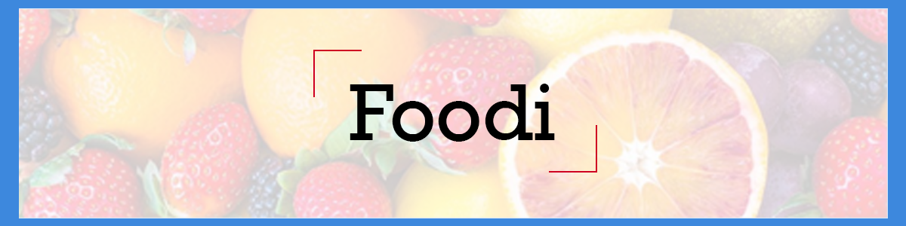

# iFoodi



## Over iFoodi

iFoodi is een app om gemakkelijk voedingswaarden van een product af te kunnen lezen! Open de Progressive Web App (en download deze naar je homescherm), Sta camera gebruik toe en begin met scannen! Data over dit product zal verschijnen op je scherm! Geen beschikking tot de camera? gebruik dan de EAN code om he product handmatig op te zoeken!

## User Story

Als foodie, wil ik tijdens het boodschappen doen een product kunnen scannen, zodat ik meer informatie over het product kan lezen en een goede keuze kan maken die bij mijn dieet past.

## Live Demo

https://foodscanner-serverside.onrender.com/

## Install

Clone deze repository naar de gewenste locatie met het command

```
git clone https://github.com/MartijnvdLans/food-scanner-serverside.git
```

Navigeer naar deze map in je terminal en run

```
npm install
```

Om de lokale server op te starten gebruik je

```
npm start
```

Je kunt nu je server bekijken via http://localhost:3000

## Features

* Producten scannen met de camera
* Producten d.m.v. de EAN handmatig in te typen opzoeken
* Voedingswaarden van een product ophalen en lezen

## hoe gebruik je de applicatie?

Om de webapplicatie te gebruiken op je de livedemo. Onder in beeld zal er een button staan 'Voeg toe op homepagina' klik hier op. na het installeren kun je tussen je apps kijken en zul je iFoodi zien staan. Open de app zoals je een normale app zou openen en je kunt de app nu zonder te navigeren op een webbrowser gebruiken!

## Performance

TBA

## Todo's

| | Done  |
| ------------- | ------------- |
| Routes to Serverside | ✅ |
| PWA -> add serviceWorker and Manifest | ✅ |
| Make app work partially offline | ✅ |
| offline page | ✅ |
| Add search by EAN to prevent a non-working app when Javascript is off | ✅ |
| Prevent detail page from saving in ServiceWorker | - |
| Add rev-manifest | - |


## Activity Diagram

TBA.

## NPM Packages

* Express
* EJS
* Node-fetch
* Nodemon (dev)

Downloaded but unused:

* express-manifest 
* manifest-rev

## API's

This application uses openfoodfacts' [API](https://world.openfoodfacts.org/data) and a Barcode detector API.

## License

[](https://opensource.org/licenses/MIT)